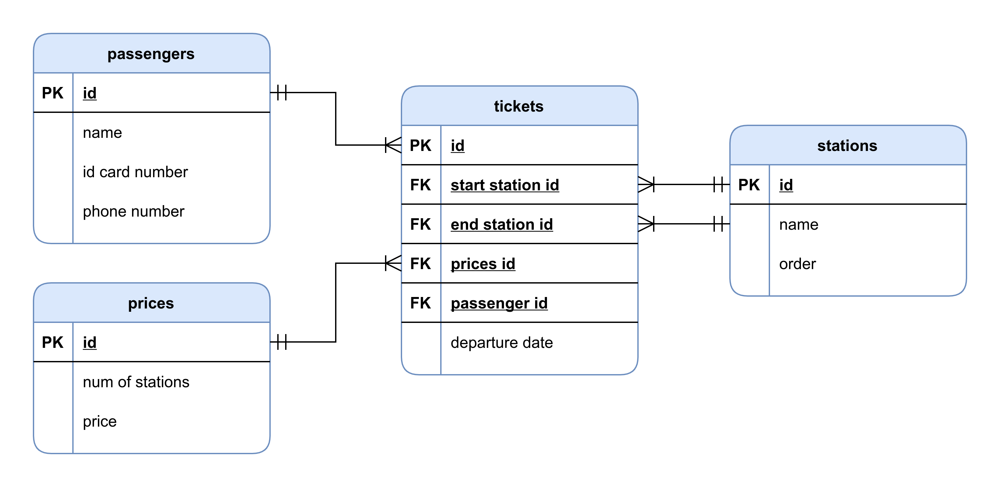

# Baramoda task

Railway system task for Baramoda company.




## Create user and database
```mysql
CREATE USER baramoda@localhost IDENTIFIED BY 'Baramoda-2021';

CREATE DATABASE baramoda;

GRANT ALL PRIVILEGES ON baramoda.* TO baramoda@localhost;

FLUSH PRIVILEGES;
```

## Run the project
1. git clone https://github.com/Hossam-Tarek/Baramoda-task.git
2. cd Baramoda-task
3. composer install
4. cp .env.example .env
5. php artisan key:generate

## Contributing

We encourage you to contribute to Baramoda task. Please check out the [CONTRIBUTING.md](./CONTRIBUTING.md).

## License

Cafeteria is Copyright © 2021 Hossam Tarek. It is a free software and redistributed
under the terms specified in the [LICENSE](./LICENSE.txt) file.
